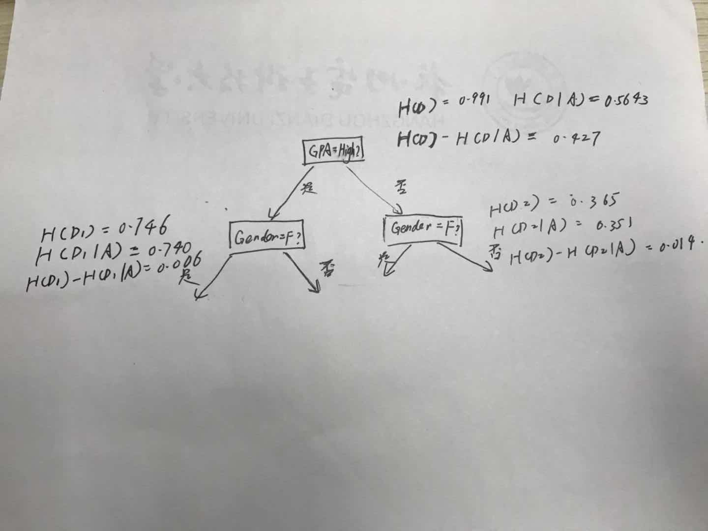

## 1 Neural Networks

test accuracy is 0.928

## 2 K-Nearest Neighbor

（b）

when we choose small k, always leads to low bias and high varience. and large k always leads to high bias and low varience. So we should choose the right answer for the special condition. Escaping for overgiiting we always choose the 5-10 for k. (1 maybe lead to overfit)

## 3 Decision Tree and ID3

## 4 K-Means Clustering

(b) You can make the initial center selection a fixed coordinate. For example, I can divide the data into k parts when the k parameter is used, and use the average coordinate of each parts as the kth initial center.

(d) If I use k = 64 compress ratio is 0.25